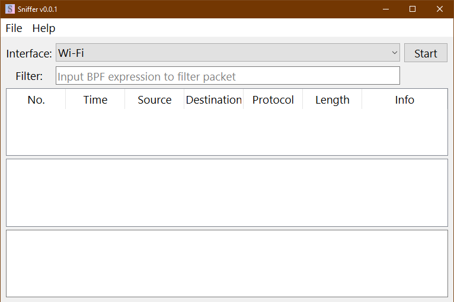
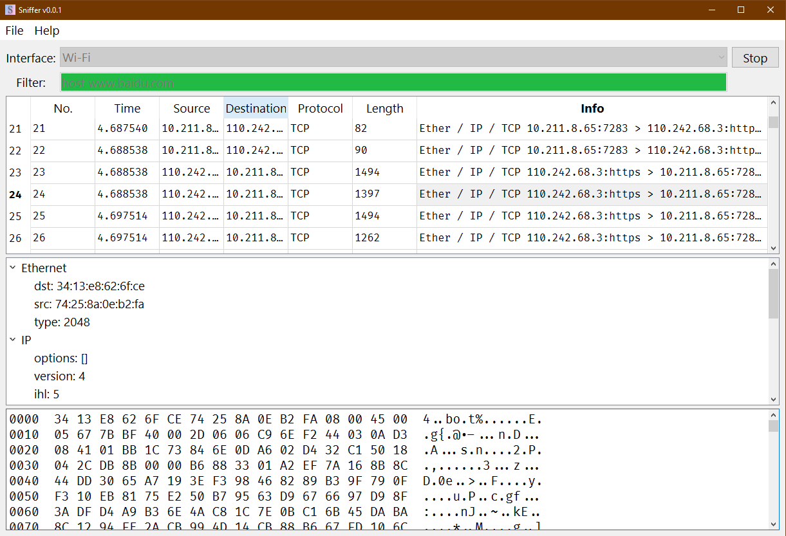

# 网络嗅探实验报告

[本项目 github 地址](https://github.com/StevenBaby/sniffer)

## 安装软件

需要安装 `requirements.txt` 中的依赖：

    pip install -r requirements.txt

其中包含了两个 Python 包：

- scapy：用于网络抓包
- pyside6：是 QT 官方的 Python 实现，用于图形界面

除此以外，对于 Windows 平台，需要安装一下两种抓包工具的其中任何一种：

- winpcap
- npcap

对于 Linux 平台需要安装 libpcap

## 执行软件

项目 `src` 目录中有 `main.py` 可以直接执行命令：

    python main.py

对于 Linux 平台，可能需要 root 权限，才能允许抓包；

软件启动后，如下图所示：

其中：

- Interface：用于选择需要抓包的网卡设备
- Filter：用于输入 BPF 表达式以过滤软件包
- 第一个输出框是包列表
- 第二个输出框是包的详细信息
- 第三个输出框是包的具体二进制信息

Filter 输入完成之后，会进行校验，检测通过之后，Filter 输入框背景颜色会变成 **绿色**，否则会变成 **红色**，并且 Start 按钮置灰，不可用；

一切准备就绪之后，就可以点击 Start 开始抓包了。

抓包完成后，可以在列表中点击任何一个包查看详细信息，如下图所示：

## 技术细节

### 抓包

抓包主要用到了 `scapy` 的两个接口，其中 `get_working_ifaces` 用于获得可用网卡设备，可以在下拉框中显示，`AsyncSniffer` 用于异步抓包；

`sniff_action` 函数，用于将抓到的包，压入队列，并调用 QT 信号通知，以供 QT 展示；

通过 `scapy` 得到的包已经具备了良好的结构，可以很容易的展示出来。

### 图形界面

使用了 pyside6 用以实现图形界面；需要注意的是不能在 `sniff_action` 函数中，直接修改 UI 的内容，修改 UI 内容只能在主线程中。

## 参考文献

- <https://scapy.readthedocs.io/en/latest/>
- <https://biot.com/capstats/bpf.html>
- <https://npcap.com/guide/>
- <https://www.winpcap.org/>
- <https://www.tcpdump.org/>
